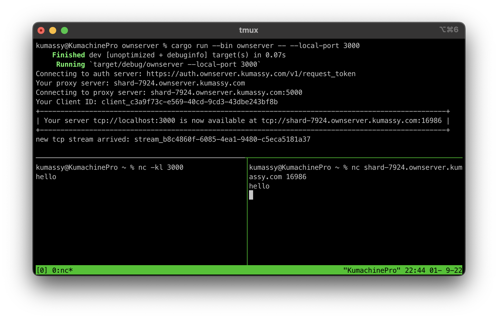

# OwnServer



Expose your local game server to the Internet.

This software aims to minimize cost and effort to prepare local game server like Minecraft, Factorio, RUST and so on.

- Cost you'll save
   - You can utilize any redundunt compute resource for game server as long as they can connect *to* the Internet.
   - You can save cost for Cloud, VPS.

- Effort you'll save
   - No firewall, NAT settings is required.
   - [GUI application](https://github.com/Kumassy/ownserver-client-gui) is also available.

## Features

- Expose your local TCP/UDP endpoint to the Internet
- Offer GUI client for game server for Minecraft, factorio, RUST, etc.

## Installation

### Recommended

install it by [cargo](https://doc.rust-lang.org/cargo/getting-started/installation.html)

```sh
cargo install ownserver
```

If you dont have cargo installed, please install [rustup](https://rustup.rs/) beforehand

### Download binary

Download binary for your OS:  
https://github.com/Kumassy/ownserver/releases

### cargo build

Optionally, you can build ownserver by yourself:

```sh
git clone https://github.com/Kumassy/ownserver.git
cd ownserver
cargo build --release
```

## Usage

:warning: This software has not yet reach stable release. Use with caution! :warning:

We also offer GUI. visit [ownserver-client-gui](https://github.com/Kumassy/ownserver-client-gui)

```sh
% ownserver -h
ownserver 0.5.1

USAGE:
    ownserver [OPTIONS]

FLAGS:
    -h, --help       Prints help information
    -V, --version    Prints version information

OPTIONS:
        --control-port <control-port>    Advanced settings [default: 5000]
        --local-port <local-port>        Port of your local game server listens e.g.) 25565 for Minecraft [default:
                                         3000]
        --payload <payload>              tcp or udp [default: tcp]
        --token-server <token-server>    Advanced settings [default: https://auth.ownserver.kumassy.com/v1/request_token]

# listen on local port
% nc -kl 3000

% ownserver --payload tcp --local-port 3000
Connecting to auth server: https://auth.ownserver.kumassy.com/v1/request_token
Your proxy server: shard-7924.ownserver.kumassy.com
Connecting to proxy server: shard-7924.ownserver.kumassy.com:5000
Your Client ID: client_755d0b36-f863-41e1-b5ff-c6c89fdb92a5
+---------------------------------------------------------------------------------------------------+
| Your server tcp://localhost:3000 is now available at tcp://shard-7924.ownserver.kumassy.com:17974 |
+---------------------------------------------------------------------------------------------------+

# you can send any TCP packet to local port!
% nc shard-7924.ownserver.kumassy.com 17974
hello
```

via cargo

```sh
% cargo run --release --bin ownserver -- -h
```

### Run Minecraft Server

```sh
# run minecraft server
java -Xmx1024M -Xms1024M -jar server.jar nogui

# run ownserver client
ownserver  -- --payload tcp --local-port 25565
```

share your public URL!

### Use the client API to inspect endpoints and streams
You can query endpoints and streams info using the client API.  
You need to specify local port to use the API: 

```
% ownserver --payload tcp --local-port 3000 --api-port 9000

% curl -s localhost:9000/endpoints
[{"id":"client_be38a93b-b7a9-46da-9d9d-51df95cad828","local_port":3000,"remote_addr":"shard-5346.ownserver.kumassy.com:13574"}]
% curl -s localhost:9000/streams
[{"id":"stream_24a3b5bb-336d-4b4e-baf3-7ef61bc1b78c"}]
```

## How it works


This app creates a private tunnel between our server and your local game server. You'll get a dedicated global public address for your server.
All requests to that public address are forwarded to your local game server throught the tunnel.

## Similer Project

- [ngrok](https://github.com/inconshreveable/ngrok)
   - written in Go
   - support HTTP, HTTPS and TCP

- [tunnelto](https://github.com/agrinman/tunnelto)
   - written in Rust
   - support HTTP

This software was initially developed as a fork of [tunnelto](https://github.com/agrinman/tunnelto).

## Contributing

### Project Layout

- ownserver/ownserver
   - include executable of client application
   - also serves library for ownserver-client-gui

- ownserver/ownserver_lib
   - define transmission protocol between client and server

- ownserver/ownserver_server
   - establish private tunnel to client
   - forward request between public endpoints to a set of client

- [ownserver-auth](https://github.com/Kumassy/ownserver-auth)
   - performs user authentication and load balancing

- [ownserver-client-gui](https://github.com/Kumassy/ownserver-client-gui)
   - GUI for ownserver client

## Running tests

```sh
cargo test
```

### Self-hosting

You need to deploy [ownserver-auth](https://github.com/Kumassy/ownserver-auth).
It issues token to ownserver client.

At first, run ownserver-auth as follows:

```sh
cd ownserver-auth/
cargo run -- --token-secret supersecret --hosts localhost
```

- generate secure string for `--token-secret`.
    - This is a secret shared between `ownserver-auth` and `ownserver-server`.
    - `ownserver_server` verifies the signature based on `--token-secret` to ensure that the token is legitimate.
- `--hosts` is a list of hostname of `ownserver_server`.
    - If you deploy multiple `ownserver_server`, list hostname of `ownserver_server` separated by commas.


Then, run `ownserver_server`:

```sh
cd ownserver/
cargo run --bin ownserver-server -- --host localhost --remote-port-start 20000 --remote-port-end 30000 --log-file ./ownserver-server.log --token-secret supersecret
```

- `--host` is the hostname for running `ownserver_server`.
- Remote ports are selected between `--remote-port-start` and `--remote-port-end`
- `--log-file` is the location of the `ownserver-server` log file
- `--token-secret` is the shared secret between `ownserver-auth` and `ownserver_server`.

Now, `ownserver-server` can accept request from `ownserver-client`:

```sh
cargo run --bin ownserver -- --payload tcp --local-port 3000 --token-server http://localhost:8123/v0/request_token
```

- You should specify `--token-server` to ensure `ownserver-client` uses your local `ownserver-auth`.

### Issue/PR

Feel free to open Issues, send Pull Requests!

### License

MIT
