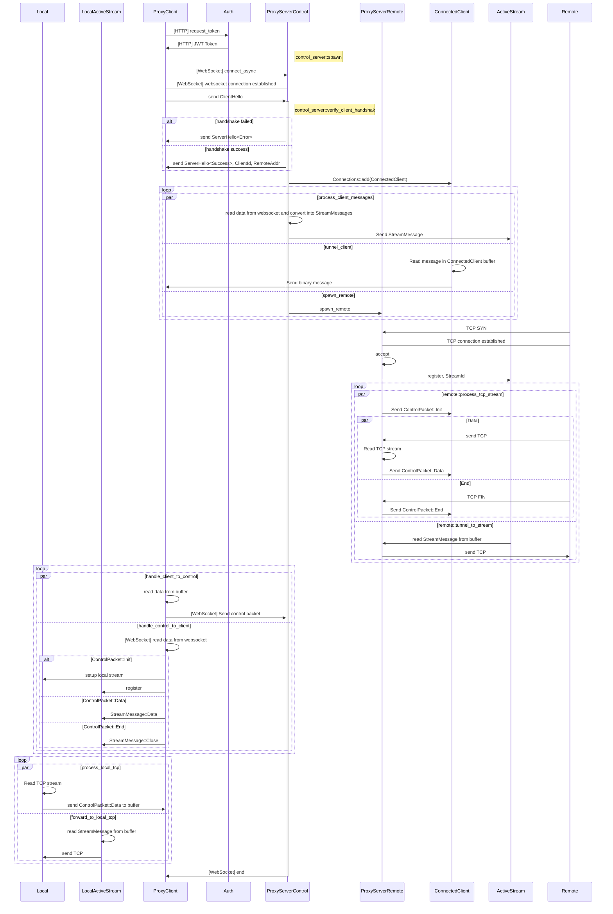

# Data Flow
## TCP

```mermaid
sequenceDiagram
    participant Local
    participant LocalActiveStream
    participant ProxyClient
    participant Auth
    participant ProxyServerControl
    participant ProxyServerRemote
    participant ConnectedClient
    participant ActiveStream
    participant Remote


    ProxyClient->>Auth: [HTTP] request_token
    Auth->>ProxyClient: [HTTP] JWT Token

    Note right of ProxyServerControl: control_server::spawn
    ProxyClient->>ProxyServerControl: [WebSocket] connect_async
    ProxyServerControl->ProxyClient: [WebSocket] websocket connection established

    ProxyClient->>+ProxyServerControl: send ClientHello

    Note right of ProxyServerControl: control_server::verify_client_handshak
    alt handshake failed
        ProxyServerControl->>ProxyClient: send ServerHello<Error>
    else handshake success
        ProxyServerControl->>ProxyClient: send ServerHello<Success>, ClientId, RemoteAddr
    end


    ProxyServerControl->>ConnectedClient: Connections::add(ConnectedClient)


    loop
        par process_client_messages
            ProxyServerControl->>ProxyServerControl: read data from websocket and convert into StreamMessages
            ProxyServerControl->>ActiveStream: Send StreamMessage
        and tunnel_client
            ConnectedClient->>ConnectedClient: Read message in ConnectedClient buffer
            ConnectedClient->>ProxyClient: Send binary message
        and spawn_remote
            ProxyServerControl->>ProxyServerRemote: spawn_remote
        end
    end


    Remote->>ProxyServerRemote: TCP SYN
    Remote->ProxyServerRemote: TCP connection established
    ProxyServerRemote->>ProxyServerRemote: accept
    ProxyServerRemote->>ActiveStream: register, StreamId

    # remote::process_tcp_stream

    loop
        par remote::process_tcp_stream
            ProxyServerRemote->>ConnectedClient: Send ControlPacket::Init

            par Data
                Remote->>ProxyServerRemote: send TCP
                ProxyServerRemote->>ProxyServerRemote: Read TCP stream
                ProxyServerRemote->>ConnectedClient: Send ControlPacket::Data
            and End
                Remote->>ProxyServerRemote: TCP FIN
                ProxyServerRemote->>ConnectedClient: Send ControlPacket::End
            end
        and remote::tunnel_to_stream
            ActiveStream->>ProxyServerRemote: read StreamMessage from buffer
            ProxyServerRemote->>Remote: send TCP
        end
    end

    loop
        par handle_client_to_control
            ProxyClient->>ProxyClient: read data from buffer
            ProxyClient->>ProxyServerControl: [WebSocket] Send control packet
        and handle_control_to_client
            ProxyClient->>ProxyClient: [WebSocket] read data from websocket
            alt ControlPacket::Init
                ProxyClient->>Local: setup local stream
                ProxyClient->>LocalActiveStream: register
            else ControlPacket::Data
                ProxyClient->>LocalActiveStream: StreamMessage::Data
            else ControlPacket::End
                ProxyClient->>LocalActiveStream: StreamMessage::Close
            end
        end
    end

    loop
        par process_local_tcp
            Local->>Local: Read TCP stream
            Local->>ProxyClient: send ControlPacket::Data to buffer
        and forward_to_local_tcp
            LocalActiveStream->>LocalActiveStream: read StreamMessage from buffer
            LocalActiveStream->>Local: send TCP
        end

    end


    ProxyServerControl->>-ProxyClient: [WebSocket] end


```