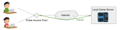

# Development Overview

This document introduces the OwnServer codebase for new contributors.

## Architecture

OwnServer forwards TCP or UDP connections from a public endpoint to a host behind NAT. The client keeps a WebSocket connection to the server and multiplexes traffic through that tunnel.



## Workspace Layout

The project is organised as a Cargo workspace with the following members:

- `ownserver` – command line client and library used by the GUI project.
- `ownserver_server` – server component that maintains WebSocket tunnels and forwards traffic.
- `ownserver_lib` – shared protocol types and utilities used by the client and server.
- `ownserver_test` – integration tests and utilities.

## Building

Ensure that the Rust toolchain is installed. Then build all crates with:

```sh
cargo build
```

## Running Tests

Execute the full test suite with:

```sh
cargo test
```

## Local Development

To experiment locally you will also need the authentication service [`ownserver-auth`](https://github.com/Kumassy/ownserver-auth).

1. Start `ownserver-auth` with a shared secret:
   ```sh
   cargo run --bin ownserver-auth -- --token-secret <secret> --hosts localhost
   ```
2. Launch the server:
   ```sh
   cargo run --bin ownserver-server -- --host localhost --remote-port-start 20000 --remote-port-end 30000 --token-secret <secret>
   ```
3. Run any local TCP server, e.g. `nc -kl 3000`.
4. Start the client and expose the local port:
   ```sh
   cargo run --bin ownserver -- --endpoint 3000/tcp --token-server http://localhost:8123/v0/request_token
   ```

## Related Projects

- [`ownserver-auth`](https://github.com/Kumassy/ownserver-auth) – issues tokens and load-balances connections.
- [`ownserver-client-gui`](https://github.com/Kumassy/ownserver-client-gui) – graphical interface for the client.

## Further Reading

Refer to the [README](../README.md) for feature descriptions, usage instructions, and contribution guidelines.
