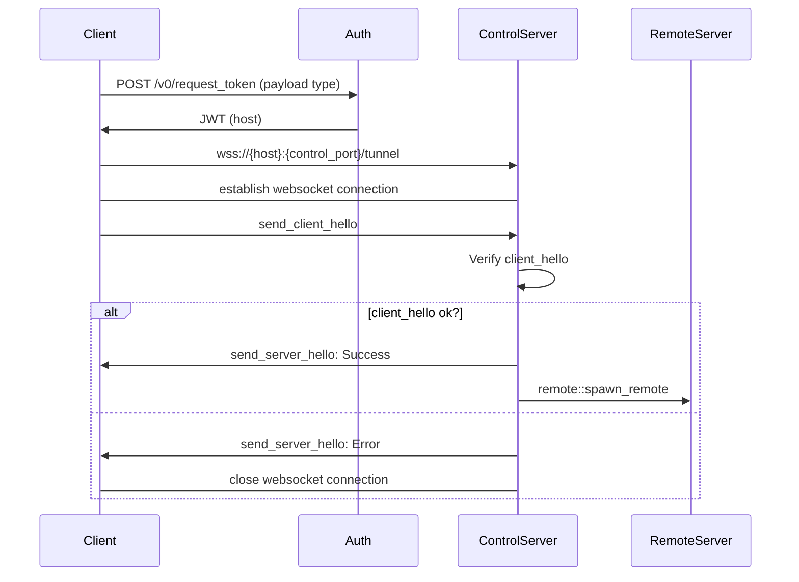
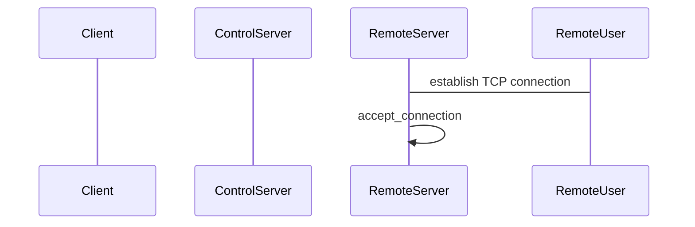

# Magic Tunnel Protocol
## Handshake

```mermaid
sequenceDiagram
    participant Client
    participant Auth
    participant ControlServer
    participant RemoteServer

    Client ->> Auth: POST /v0/request_token (payload type)
    Auth ->> Client: JWT (host)

    Client ->> ControlServer: wss://{host}:{control_port}/tunnel
    ControlServer -> Client: establish websocket connection

    Client ->> ControlServer: send_client_hello
    ControlServer ->> ControlServer: Verify client_hello

    alt client_hello ok?
        ControlServer ->> Client: send_server_hello: Success
        ControlServer ->> RemoteServer: remote::spawn_remote
    else
        ControlServer ->> Client: send_server_hello: Error
        ControlServer -> Client: close websocket connection
    end
```

## Tunneling

```mermaid
sequenceDiagram
    participant Client
    participant ControlServer
    participant RemoteServer
    participant RemoteUser

    RemoteUser -> RemoteServer: establish TCP connection
    RemoteServer ->> RemoteServer: accept_connection
```